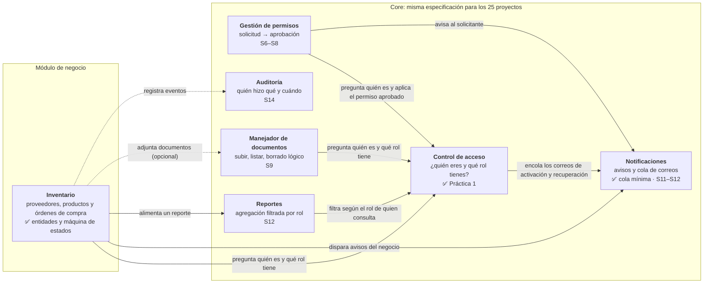

# Sistema de Inventario para Negocio Pequeño

Proyecto Final — **Programación III**
Instituto Tecnológico de las Américas (ITLA) — Cuatrimestre **2026-C-3**

| Campo | Valor |
|---|---|
| Estudiante | Yojairo Rodriguez |
| Asignatura | Programación III |
| Período | 2026-C-3 |
| Repositorio | https://github.com/yojairoivan-sketch/Proyecto-Final-P3 |
| Proyecto del catálogo | **#6 — Inventario para negocio pequeño** |

Aplicación web para que un negocio pequeño lleve el control de su inventario: **órdenes de compra** a proveedores, **movimientos de stock** y **alertas de stock bajo**. Como todos los proyectos del curso, tiene dos partes: el **Core** (la misma especificación para los 25 proyectos) y el **módulo de negocio** (inventario).

## Estado: Práctica 1 — Control de acceso

Entregado en la etiqueta `practica-1`:

- **Control de acceso completo** (pieza 1 del Core): registro con activación por correo, sesión con bloqueo por intentos, roles y administración de usuarios, recuperación, cambio y restablecimiento forzado de contraseña. Cubre RF-CA-01 a RF-CA-22.
- **Cola mínima de correos**: las operaciones encolan y un enviador independiente entrega (RF-NOT-08, 09, 12 y 13).
- **Estructura de la máquina de estados del negocio**: la orden de compra, en [`docs/maquina-de-estados.md`](docs/maquina-de-estados.md).
- Cada funcionalidad entró por su pull request: [#4 base](https://github.com/yojairoivan-sketch/Proyecto-Final-P3/pull/4), [#5 cola de correos](https://github.com/yojairoivan-sketch/Proyecto-Final-P3/pull/5), [#6 registro y activación](https://github.com/yojairoivan-sketch/Proyecto-Final-P3/pull/6), [#7 sesión](https://github.com/yojairoivan-sketch/Proyecto-Final-P3/pull/7), [#8 roles y administración](https://github.com/yojairoivan-sketch/Proyecto-Final-P3/pull/8), [#9 contraseñas](https://github.com/yojairoivan-sketch/Proyecto-Final-P3/pull/9), [#10 máquina de estados](https://github.com/yojairoivan-sketch/Proyecto-Final-P3/pull/10) y el PR de este README.

## Diagrama de componentes

Un solo contenedor (la aplicación) con las seis piezas del Core y el módulo de negocio. Cada flecha va de la pieza que **requiere** a la que **provee**, y la etiqueta dice para qué. El Core nunca apunta al módulo de negocio (RD-03).



Casi todas las piezas registran sus acciones en Auditoría; esa flecha punteada se dibuja una sola vez para no llenar el diagrama. Las piezas marcadas con ✅ ya están construidas; las demás indican la semana en que llegan.

| Pieza | Proyecto | Interfaz que ofrece a las demás |
|---|---|---|
| Control de acceso | `backend/src/Inventario.Core.ControlAcceso` | `IUsuarioActual` («¿quién es y qué rol?»), `IServicioCuentas`, `IServicioSesiones`, `IServicioContrasenas`, `IServicioUsuarios` |
| Notificaciones (cola de correos) | `backend/src/Inventario.Core.ColaCorreos` | `IColaCorreos.EncolarAsync` y `ProcesadorCola` |
| Módulo de negocio | `backend/src/Inventario.Negocio` | `OrdenDeCompra.CambiarEstado` y `TransicionesOrdenCompra` |
| Host de la API | `backend/src/Inventario.Api` | Endpoints HTTP delgados y la tabla de roles por operación (`Acceso/Operaciones.cs`) |
| Enviador | `backend/src/Inventario.Enviador` | Proceso aparte que entrega la cola por SMTP |

Cada pieza tiene su propio esquema en PostgreSQL (`control_acceso`, `cola_correos` e `inventario`). Ninguna lee las tablas de otra: todo pasa por interfaces. Ningún proyecto `Inventario.Core.*` referencia a `Inventario.Negocio`.

## Estructura del repositorio

```
.
├── backend/
│   ├── Inventario.slnx                 # solución .NET 10
│   ├── Dockerfile                      # etapas api y enviador
│   └── src/
│       ├── Inventario.Api/             # host: endpoints, Operaciones.cs, errores
│       ├── Inventario.Core.ControlAcceso/
│       ├── Inventario.Core.ColaCorreos/
│       ├── Inventario.Enviador/        # consola que entrega la cola
│       └── Inventario.Negocio/         # módulo de inventario
├── frontend/                           # React 19 + TypeScript + Vite, servido por nginx
├── docs/                               # máquina de estados y bitácoras
├── docker-compose.yml
└── .env.example
```

## Tecnologías

| Capa | Tecnología |
|---|---|
| Backend | C# / .NET 10 (LTS) — ASP.NET Core, Minimal APIs |
| ORM | Entity Framework Core 10 con Npgsql |
| Frontend | React 19 + TypeScript + Vite, servido por nginx |
| Base de datos | PostgreSQL 17 |
| Correo | MailKit; Mailpit para pruebas locales |
| Entorno | Docker Compose |

En la declaración de la semana 1 el stack decía .NET 9. Se cambió a **.NET 10**, la versión LTS actual: el soporte de .NET 9 termina el 10 de noviembre de 2026, antes de que acabe el cuatrimestre.

## Notas de diseño

- **La lógica no vive en los endpoints (RD-02):** los endpoints solo traducen HTTP. Las reglas están en los servicios de cada pieza, que devuelven un resultado con un mensaje controlado.
- **Errores (RD-08):** toda respuesta de error es un ProblemDetails en español, sin trazas, rutas ni consultas.
- **Fechas (RD-11):** todas las piezas toman la hora de un único `TimeProvider` y la guardan en UTC (`timestamptz`).
- **Credenciales:** los tokens de sesión, de activación y de recuperación son 32 bytes aleatorios. En la base solo queda su SHA-256, así que leer las tablas no permite usarlos.
- **Bitácoras anteriores:** [`docs/bitacora-asignacion-1.md`](docs/bitacora-asignacion-1.md).
