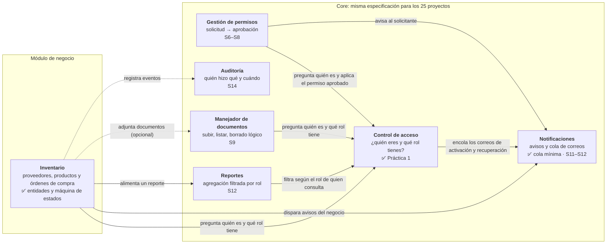

# Sistema de Inventario para Negocio Pequeño

Proyecto Final — **Programación III**
Instituto Tecnológico de las Américas (ITLA) — Cuatrimestre **2026-C-3**

| Campo | Valor |
|---|---|
| Estudiante | Yojairo Rodriguez |
| Asignatura | Programación III |
| Período | 2026-C-3 |
| Repositorio | https://github.com/yojairoivan-sketch/Proyecto-Final-P3 |
| Proyecto del catálogo | **#6 — Inventario para negocio pequeño** |

Aplicación web para que un negocio pequeño lleve el control de su inventario: **órdenes de compra** a proveedores, **movimientos de stock** y **alertas de stock bajo**. Como todos los proyectos del curso, tiene dos partes: el **Core** (la misma especificación para los 25 proyectos) y el **módulo de negocio** (inventario).

## Estado: Práctica 1 — Control de acceso

Entregado en la etiqueta `practica-1`:

- **Control de acceso completo** (pieza 1 del Core): registro con activación por correo, sesión con bloqueo por intentos, roles y administración de usuarios, recuperación, cambio y restablecimiento forzado de contraseña. Cubre RF-CA-01 a RF-CA-22.
- **Cola mínima de correos**: las operaciones encolan y un enviador independiente entrega (RF-NOT-08, 09, 12 y 13).
- **Estructura de la máquina de estados del negocio**: la orden de compra, en [`docs/maquina-de-estados.md`](docs/maquina-de-estados.md).
- Cada funcionalidad entró por su pull request: [#4 base](https://github.com/yojairoivan-sketch/Proyecto-Final-P3/pull/4), [#5 cola de correos](https://github.com/yojairoivan-sketch/Proyecto-Final-P3/pull/5), [#6 registro y activación](https://github.com/yojairoivan-sketch/Proyecto-Final-P3/pull/6), [#7 sesión](https://github.com/yojairoivan-sketch/Proyecto-Final-P3/pull/7), [#8 roles y administración](https://github.com/yojairoivan-sketch/Proyecto-Final-P3/pull/8), [#9 contraseñas](https://github.com/yojairoivan-sketch/Proyecto-Final-P3/pull/9), [#10 máquina de estados](https://github.com/yojairoivan-sketch/Proyecto-Final-P3/pull/10) y el PR de este README.

## Diagrama de componentes

Un solo contenedor (la aplicación) con las seis piezas del Core y el módulo de negocio. Cada flecha va de la pieza que **requiere** a la que **provee**, y la etiqueta dice para qué. El Core nunca apunta al módulo de negocio (RD-03).



Casi todas las piezas registran sus acciones en Auditoría; esa flecha punteada se dibuja una sola vez para no llenar el diagrama. Las piezas marcadas con ✅ ya están construidas; las demás indican la semana en que llegan.

| Pieza | Proyecto | Interfaz que ofrece a las demás |
|---|---|---|
| Control de acceso | `backend/src/Inventario.Core.ControlAcceso` | `IUsuarioActual` («¿quién es y qué rol?»), `IServicioCuentas`, `IServicioSesiones`, `IServicioContrasenas`, `IServicioUsuarios` |
| Notificaciones (cola de correos) | `backend/src/Inventario.Core.ColaCorreos` | `IColaCorreos.EncolarAsync` y `ProcesadorCola` |
| Módulo de negocio | `backend/src/Inventario.Negocio` | `OrdenDeCompra.CambiarEstado` y `TransicionesOrdenCompra` |
| Host de la API | `backend/src/Inventario.Api` | Endpoints HTTP delgados y la tabla de roles por operación (`Acceso/Operaciones.cs`) |
| Enviador | `backend/src/Inventario.Enviador` | Proceso aparte que entrega la cola por SMTP |

Cada pieza tiene su propio esquema en PostgreSQL (`control_acceso`, `cola_correos` e `inventario`). Ninguna lee las tablas de otra: todo pasa por interfaces. Ningún proyecto `Inventario.Core.*` referencia a `Inventario.Negocio`.

## Requisitos

- **Docker Desktop** con Docker Compose v2 (`docker compose version`), ya iniciado.
- **Git**. Los comandos de abajo funcionan en Git Bash y en PowerShell, salvo los de `curl`, que están escritos para **Git Bash** (en Windows PowerShell 5.1, `curl` es otro comando).
- Puertos libres: **8080** (la aplicación) y **8025** (Mailpit). PostgreSQL no publica puerto, así que no choca con otro que tengas instalado.

No hace falta instalar .NET, Node ni PostgreSQL: todo se compila y corre dentro de Docker.

## Cómo ejecutarlo

```bash
git clone https://github.com/yojairoivan-sketch/Proyecto-Final-P3.git
cd Proyecto-Final-P3
git checkout practica-1
cp .env.example .env
```

Abre `.env` y completa los valores vacíos (la tabla de abajo dice qué es cada uno):

- `POSTGRES_PASSWORD`: cualquier contraseña.
- `ADMIN_NOMBRE`, `ADMIN_CORREO` y `ADMIN_CONTRASENA`: el primer Administrador. La contraseña debe tener de 8 a 128 caracteres, con letras y números.
- `SMTP_REMITENTE` y, si quieres que el correo llegue a una bandeja real, el resto de `SMTP_*` (ver [Correo real](#correo-real-gmail)). Con los valores por defecto los correos llegan a Mailpit.

Después:

```bash
docker compose up --build -d
```

La primera vez tarda unos minutos, porque descarga las imágenes y compila. Cuando termine:

| Qué | Dónde |
|---|---|
| Aplicación (React) | http://localhost:8080 |
| API | http://localhost:8080/api (por ejemplo, http://localhost:8080/api/salud) |
| Bandeja de Mailpit (correo de pruebas) | http://localhost:8025 |

La portada dice «API: conectada». Para ver los registros de la API: `docker compose logs api`.

**Enviar los correos.** Las operaciones solo dejan los correos en la cola. Para entregarlos, corre el enviador:

```bash
docker compose run --rm enviador
```

Hace una pasada y termina. Si prefieres que los envíe solo cada 10 segundos, déjalo corriendo en otra terminal con `docker compose run --rm enviador --vigilar 10` (Ctrl+C lo detiene).

Para apagar todo: `docker compose down`. Los datos quedan en el volumen y vuelven en el siguiente `up`. `docker compose down -v` sí borra la base.

### Variables de entorno

Todas van en `.env`, que nunca se sube al repositorio. `.env.example` trae los nombres y solo los valores que no son secretos.

| Variable | Para qué | Obligatoria |
|---|---|---|
| `POSTGRES_DB` | Nombre de la base de datos. | Sí (trae `inventario`) |
| `POSTGRES_USER` | Usuario de la base de datos. | Sí (trae `inventario`) |
| `POSTGRES_PASSWORD` | Contraseña de ese usuario. | Sí, la eliges tú |
| `URL_PUBLICA` | Dirección con la que se abre la aplicación; con ella se arman los enlaces de los correos. | Sí (trae `http://localhost:8080`) |
| `ADMIN_NOMBRE` | Nombre del primer Administrador, que se crea al arrancar si no existe. | Sí |
| `ADMIN_CORREO` | Correo con el que entra ese Administrador. | Sí |
| `ADMIN_CONTRASENA` | Su contraseña (8 a 128 caracteres, con letras y números). | Sí |
| `SMTP_HOST` | Servidor de correo saliente. | Sí (trae `mailpit`) |
| `SMTP_PUERTO` | Puerto de ese servidor. | Sí (trae `1025`) |
| `SMTP_SEGURIDAD` | `Ninguna`, `StartTls` o `SslAlConectar`. | Sí (trae `Ninguna`) |
| `SMTP_USUARIO` | Usuario del servidor de correo. | Solo si el servidor pide autenticación |
| `SMTP_CONTRASENA` | Contraseña de ese usuario (en Gmail, una contraseña de aplicación). | Solo si el servidor pide autenticación |
| `SMTP_REMITENTE` | Dirección que aparece como remitente. | Sí |
| `WEB_PUERTO` | Puerto de la aplicación en tu máquina, si el 8080 está ocupado. Si lo cambias, cambia también `URL_PUBLICA`. | No (8080) |
| `MAILPIT_PUERTO` | Puerto de la bandeja de Mailpit, si el 8025 está ocupado. | No (8025) |

Si falta una variable obligatoria, `docker compose` se detiene y dice cuál. Solo el enviador recibe las variables `SMTP_*`: la API no las tiene, así que una operación nunca habla con el servidor de correo.

### Correo real (Gmail)

Para que los correos lleguen a una bandeja real (por ejemplo, al registrarte con tu propio correo), usa una cuenta de Gmail con verificación en dos pasos:

1. En https://myaccount.google.com/apppasswords crea una contraseña de aplicación (16 letras).
2. En `.env` pon:
   - `SMTP_HOST=smtp.gmail.com`
   - `SMTP_PUERTO=587`
   - `SMTP_SEGURIDAD=StartTls`
   - `SMTP_USUARIO` y `SMTP_REMITENTE`: tu dirección de Gmail.
   - `SMTP_CONTRASENA`: la contraseña de aplicación, sin espacios.
3. Después de cada operación que manda correo, corre `docker compose run --rm enviador` (o déjalo con `--vigilar 10`). El correo llega a la bandeja del destinatario y su enlace abre `URL_PUBLICA`.

No hace falta reiniciar la API: el enviador lee `.env` cada vez que se ejecuta.

## Cómo provocar cada criterio de aceptación

Todo se puede hacer desde la interfaz (http://localhost:8080) o armando la petición a mano con `curl`. Los `curl` de abajo son para **Git Bash**.

**Preparación.** Para leer la base de datos:

```bash
docker compose exec db psql -U inventario -d inventario
```

(Si cambiaste `POSTGRES_USER` o `POSTGRES_DB`, usa tus valores.) Dentro de `psql`, `\q` sale.

Para guardar la credencial de sesión de un usuario en la variable `TOKEN` (cambia correo y contraseña):

```bash
TOKEN=$(curl -s http://localhost:8080/api/acceso/sesion -H 'Content-Type: application/json' -d '{"correo":"tu@correo.com","contrasena":"TuClave123"}' | sed -nE 's/.*"token":"([^"]+)".*/\1/p'); echo $TOKEN
```

### 1. Registro y activación (RF-CA-01, 02, 04, 14, 15, 16 y 17)

| Para comprobar | Haz esto | Resultado esperado |
|---|---|---|
| Registro | En `/registro` crea una cuenta con tu correo y una contraseña válida (por ejemplo `clave1234`). | «Cuenta creada. Te enviamos un correo con el enlace para activarla.» |
| Login antes de activar | En `/iniciar-sesion` entra con esa cuenta. | «La cuenta no está activa. Ábrela con el enlace que te enviamos por correo.» (403) |
| El correo sale por la cola | `docker compose run --rm enviador` y abre el correo (en tu bandeja o en http://localhost:8025). | Llega «Activa tu cuenta de Inventario» con el enlace. |
| Abrir el enlace | Ábrelo. | «Cuenta activada. Ya puedes iniciar sesión.» |
| Abrirlo por segunda vez | Vuelve a abrir el mismo enlace. | «Este enlace de activación ya se usó…» (400). La cuenta no cambia. |
| Correo duplicado | Regístrate otra vez con el mismo correo. | «Ya existe una cuenta con ese correo.» (409) |
| Contraseña de 5 caracteres | Regístrate con la contraseña `ab123`. | «La contraseña debe tener al menos 8 caracteres.» (400) |
| Correo mal formado | Regístrate con el correo `ana@@ejemplo`. | «El correo no tiene un formato válido.» (400) |
| Datos vacíos o JSON roto | `curl -i http://localhost:8080/api/acceso/registro -H 'Content-Type: application/json' -d '{"nombre":'` | 400 con un mensaje en español, sin trazas. |
| Reenvío del enlace | En `/reenviar-activacion` pide el enlace con un correo inexistente y con uno pendiente de activar. | La misma respuesta en los dos casos. El enlace anterior deja de servir: «Este enlace ya no sirve porque se pidió uno nuevo…». |
| Enlace vencido | Pide un enlace nuevo, corre en `psql` `update control_acceso.tokens_activacion set vence_en = now() - interval '1 minute' where not usado;` y abre el enlace. | «Este enlace de activación venció. Pide uno nuevo.» (400) |
| Rol único | En `psql`: `select correo, rol_id from control_acceso.usuarios;` | Cada usuario tiene un `rol_id` (1 = Administrador, 2 = Estándar); la columna no admite nulos. Todo usuario nuevo nace Estándar. |

### 2. Almacenamiento de las contraseñas (RF-CA-02, RD-05)

Registra y activa dos usuarios con la **misma** contraseña y, en `psql`:

```sql
select correo, hash_contrasena from control_acceso.usuarios;
```

La contraseña no aparece en ninguna columna, y los dos hashes son distintos. Es PBKDF2 con sal aleatoria (`PasswordHasher` de ASP.NET Core Identity), así que no se puede revertir.

### 3. Sesión (RF-CA-03, 07, 18 y 19)

| Para comprobar | Haz esto | Resultado esperado |
|---|---|---|
| Rechazos idénticos | Inicia sesión con tu correo y una contraseña incorrecta, y luego con un correo que no existe. | Los dos dan «Correo o contraseña incorrectos.» (401), sin decir cuál dato falló. |
| Sesión correcta | Entra con los datos correctos. | Lleva a `/cuenta` con tu nombre, correo y rol (`GET /api/yo`). |
| Consulta sin sesión | `curl -i http://localhost:8080/api/yo` | 401: «Necesitas iniciar sesión para usar esta operación.» |
| Cerrar sesión | Guarda tu `TOKEN` y ciérrala: `curl -i -X DELETE http://localhost:8080/api/acceso/sesion -H "Authorization: Bearer $TOKEN"` | «Sesión cerrada.» |
| Credencial cerrada | `curl -i http://localhost:8080/api/yo -H "Authorization: Bearer $TOKEN"` | 401: «La sesión no es válida o ya terminó…» |
| Bloqueo | Falla la contraseña cinco veces seguidas y luego usa la correcta. | El sexto intento da «La cuenta está bloqueada por 5 intentos fallidos seguidos. Intenta de nuevo en 15 minutos.» (423), aunque la contraseña sea correcta. |
| Fin del bloqueo y contador | Espera 15 minutos o, en `psql`, `update control_acceso.usuarios set bloqueado_hasta = now() where correo = 'tu@correo.com';`. Entra con la contraseña correcta. | Entra, y `select intentos_fallidos from control_acceso.usuarios where correo = 'tu@correo.com';` da 0. |

### 4. Roles y administración (RF-CA-04, 05, 06, 08, 20 y 21, RD-06)

**Exigencia de rol en un solo punto (RF-CA-05):** [`backend/src/Inventario.Api/Acceso/Operaciones.cs`](backend/src/Inventario.Api/Acceso/Operaciones.cs). Cada operación del sistema está ahí, en una línea, con los roles que la pueden ejecutar. Cada endpoint la declara con `.Requiere(Operaciones.X)`; si un endpoint no la declara, la API no arranca. El servidor verifica sesión y rol en cada petición, antes de leer el cuerpo.

| Operación | Quién |
|---|---|
| ConsultarSalud, Registrarse, ActivarCuenta, ReenviarActivacion, IniciarSesion, SolicitarRecuperacion, RestablecerContrasena | Pública |
| ConsultarMiCuenta, CerrarSesion, CambiarMiContrasena | Administrador o Estándar |
| ListarUsuarios, CambiarRol, DesactivarUsuario, ReactivarUsuario, ForzarRestablecimiento | Administrador |

| Para comprobar | Haz esto | Resultado esperado |
|---|---|---|
| Estándar invoca una operación de Administrador a mano | Con el `TOKEN` de un usuario Estándar: `curl -i http://localhost:8080/api/usuarios -H "Authorization: Bearer $TOKEN"` | 403: «La operación ListarUsuarios es solo para: Administrador. Tu rol es Estándar.» |
| Estándar intenta cambiar su propio rol | Con su `TOKEN` y su id (sale en `GET /api/yo`): `curl -i -X PUT http://localhost:8080/api/usuarios/<id>/rol -H "Authorization: Bearer $TOKEN" -H 'Content-Type: application/json' -d '{"rol":"Administrador"}'` | 403. El rol no cambia. |
| Listar usuarios | Entra con el Administrador de `.env` y abre `/usuarios`. | Nombre, correo, rol y estado (Activo, Pendiente de activación o Desactivado). La respuesta de `GET /api/usuarios` no trae hashes ni tokens. |
| Cambiar un rol | En `/usuarios`, cambia el rol de otro usuario con el selector. | «Rol cambiado a …». Con `curl`, el cuerpo es `{"rol":"Administrador"}` o `{"rol":"Estandar"}` (se acepta con o sin tilde). |
| Desactivar a un usuario con sesión abierta | Entra con ese usuario en otro navegador (o guarda su `TOKEN`). Como Administrador, pulsa «Desactivar». Luego usa su sesión: `curl -i http://localhost:8080/api/yo -H "Authorization: Bearer $TOKEN"` | Su sesión da 401, y si intenta entrar: «La cuenta está desactivada. Habla con un administrador.» (403). «Reactivar» le devuelve el acceso. |
| Desactivarse a sí mismo | En `/usuarios`, pulsa «Desactivar» en tu propia fila. | «Un Administrador no puede desactivarse a sí mismo.» (409) |
| Último Administrador | Intenta pasarte a Estándar cuando eres el único Administrador activo. | «No se puede quitar el rol al último Administrador activo.» (409) |

### 5. Contraseñas: recuperación, cambio y restablecimiento (RF-CA-09 a 13 y 22)

| Para comprobar | Haz esto | Resultado esperado |
|---|---|---|
| Respuesta idéntica | En `/recuperar` pide el código con un correo inexistente y con uno registrado. | Los dos: «Si el correo corresponde a una cuenta activa, te enviamos un código…». |
| Código por la cola | `docker compose run --rm enviador` y abre el correo «Código para restablecer tu contraseña…». | Trae el código y el enlace `/restablecer?codigo=...`, que vence en 30 minutos. |
| Usar el código | Abre el enlace y define una contraseña nueva. | «Contraseña cambiada…». |
| Usarlo otra vez | Vuelve a enviar el mismo código. | «Este código de recuperación ya se usó…» (400). La contraseña no cambia. |
| Contraseña vieja y nueva | Inicia sesión con la vieja y luego con la nueva. | La vieja da 401; la nueva entra. |
| Credencial emitida antes | Guarda un `TOKEN` antes de restablecer y úsalo después: `curl -i http://localhost:8080/api/yo -H "Authorization: Bearer $TOKEN"` | 401. |
| Código vencido | Pide otro código, corre en `psql` `update control_acceso.codigos_recuperacion set vence_en = now() - interval '1 minute' where not usado;` y úsalo. | «El código de recuperación venció. Pide uno nuevo.» (400). La contraseña no cambia. |
| Restablecimiento forzado | Como Administrador, en `/usuarios` pulsa «Forzar restablecimiento» en otro usuario. | Su contraseña anterior y sus sesiones dejan de servir en ese momento. Al correr el enviador le llega «Un administrador restableció tu contraseña…» con el código. |
| Cambio con la actual incorrecta | En `/cuenta`, cambia la contraseña escribiendo mal la actual. | «La contraseña actual no es correcta. La contraseña no cambió.» (400) |
| Cambio correcto | Cambia la contraseña con la actual correcta. | Todas las sesiones se cierran (también la actual) y hay que entrar con la nueva. La nueva también debe cumplir la política. |

### 6. Correo por cola (RF-NOT-08, 09, 12 y 13)

1. Apaga el servidor de correo de pruebas: `docker compose stop mailpit`.
2. Registra un usuario nuevo en `/registro`. La operación termina bien: la API nunca habla con el servidor SMTP.
3. En `psql`: `select id, destinatario, estado, intentos, ultimo_error from cola_correos.correos_en_cola order by id;`. El correo está **Pendiente**.
4. Corre el enviador con el servidor apagado: `docker compose run --rm enviador`. El correo cuenta como «Con error (siguen pendientes)». En la tabla sigue Pendiente, con `intentos = 1` y el error en `ultimo_error`.
5. Enciende el servidor (`docker compose start mailpit`) y corre el enviador **dos veces**. La primera lo envía («Enviados: …»); la segunda dice «No hay correos pendientes.». En Mailpit el correo aparece una sola vez.

Si usas Gmail en vez de Mailpit, el paso 1 se hace apuntando el enviador a un servidor que no existe solo para esa ejecución: `docker compose run --rm -e SMTP_HOST=no-existe.invalid enviador`.

Las credenciales SMTP solo están en `.env` (fuera del repositorio) y se leen como variables de entorno.

### 7. Reinicio (RD-09)

```bash
docker compose restart
```

Los usuarios siguen ahí: entra con cualquiera de ellos. También sobreviven a `docker compose down` + `docker compose up -d`, porque la base vive en el volumen `datos-postgres`.

### 8. Máquina de estados del negocio (RF-NEG-03, 04, 05, RD-04)

- Estados, en un solo lugar: [`backend/src/Inventario.Negocio/Ordenes/EstadoOrdenCompra.cs`](backend/src/Inventario.Negocio/Ordenes/EstadoOrdenCompra.cs).
- Transiciones, en un solo lugar, con la prohibida explícita y los terminales: [`backend/src/Inventario.Negocio/Ordenes/TransicionesOrdenCompra.cs`](backend/src/Inventario.Negocio/Ordenes/TransicionesOrdenCompra.cs).
- Tabla de transiciones y diagrama: [`docs/maquina-de-estados.md`](docs/maquina-de-estados.md).
- La entidad y su estado en la base: `\d inventario.ordenes_de_compra` en `psql` (columna `estado`).

### 9. Historial

```bash
git log --oneline --graph --all
git ls-files
git log -p | grep -iE "SMTP_CONTRASENA=|POSTGRES_PASSWORD=|ADMIN_CONTRASENA="
```

Cada funcionalidad entró por su pull request, fusionado con merge commit. `.env` no está en el repositorio. La búsqueda solo encuentra las líneas vacías de `.env.example` y el propio comando de arriba en este README.

## Estructura del repositorio

```
.
├── backend/
│   ├── Inventario.slnx                 # solución .NET 10
│   ├── Dockerfile                      # etapas api y enviador
│   └── src/
│       ├── Inventario.Api/             # host: endpoints, Operaciones.cs, errores
│       ├── Inventario.Core.ControlAcceso/
│       ├── Inventario.Core.ColaCorreos/
│       ├── Inventario.Enviador/        # consola que entrega la cola
│       └── Inventario.Negocio/         # módulo de inventario
├── frontend/                           # React 19 + TypeScript + Vite, servido por nginx
├── docs/                               # máquina de estados y bitácoras
├── docker-compose.yml
└── .env.example
```

## Tecnologías

| Capa | Tecnología |
|---|---|
| Backend | C# / .NET 10 (LTS) — ASP.NET Core, Minimal APIs |
| ORM | Entity Framework Core 10 con Npgsql |
| Frontend | React 19 + TypeScript + Vite, servido por nginx |
| Base de datos | PostgreSQL 17 |
| Correo | MailKit; Mailpit para pruebas locales |
| Entorno | Docker Compose |

En la declaración de la semana 1 el stack decía .NET 9. Se cambió a **.NET 10**, la versión LTS actual: el soporte de .NET 9 termina el 10 de noviembre de 2026, antes de que acabe el cuatrimestre.

## Notas de diseño

- **La lógica no vive en los endpoints (RD-02):** los endpoints solo traducen HTTP. Las reglas están en los servicios de cada pieza, que devuelven un resultado con un mensaje controlado.
- **Errores (RD-08):** toda respuesta de error es un ProblemDetails en español, sin trazas, rutas ni consultas.
- **Fechas (RD-11):** todas las piezas toman la hora de un único `TimeProvider` y la guardan en UTC (`timestamptz`).
- **Credenciales:** los tokens de sesión, de activación y de recuperación son 32 bytes aleatorios. En la base solo queda su SHA-256, así que leer las tablas no permite usarlos.
- **Bitácoras anteriores:** [`docs/bitacora-asignacion-1.md`](docs/bitacora-asignacion-1.md).
