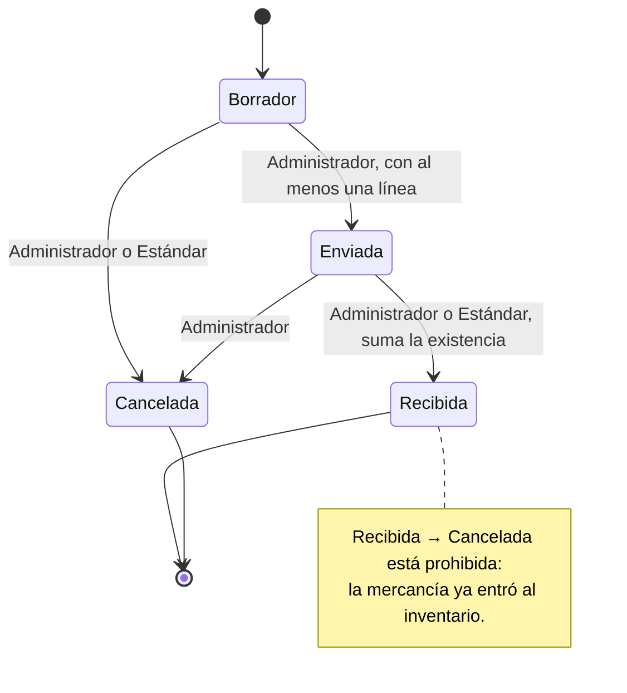

# Máquina de estados: orden de compra

La entidad central del módulo de negocio es la **orden de compra** (`OrdenDeCompra`): un pedido de mercancía a un proveedor, con una o más líneas (producto, cantidad y costo). Su atributo de estado es la columna `estado` de `inventario.ordenes_de_compra`.

| Qué | Dónde está en el código |
|---|---|
| Estados (RF-NEG-03) | [`EstadoOrdenCompra.cs`](../backend/src/Inventario.Negocio/Ordenes/EstadoOrdenCompra.cs) |
| Transiciones, prohibidas y terminales (RD-04, RF-NEG-04, RF-NEG-05) | [`TransicionesOrdenCompra.cs`](../backend/src/Inventario.Negocio/Ordenes/TransicionesOrdenCompra.cs) |
| Aplicación de una transición | `OrdenDeCompra.CambiarEstado`, que solo consulta la tabla anterior |

Agregar una transición nueva es agregar una línea en `TransicionesOrdenCompra.Permitidas`; ningún otro archivo valida estados.

## Estados

| Estado | Significado | ¿Terminal? |
|---|---|---|
| Borrador | La orden se está armando: se le pueden agregar líneas. Toda orden nace aquí. | No |
| Enviada | Se le envió al proveedor y se espera la mercancía. | No |
| Recibida | La mercancía llegó y entró al inventario. | **Sí** |
| Cancelada | Se anuló antes de recibirla. | **Sí** |

## Transiciones

| Desde | Hacia | Quién la ejecuta | Condición |
|---|---|---|---|
| Borrador | Enviada | Administrador | La orden tiene al menos una línea. |
| Borrador | Cancelada | Administrador o Estándar | Ninguna. |
| Enviada | Recibida | Administrador o Estándar | Al recibirla, la cantidad de cada línea se suma a la existencia del producto. |
| Enviada | Cancelada | Administrador | Ninguna. |
| Recibida | Cancelada | — | **Prohibida.** La mercancía ya entró al inventario; se corrige con un ajuste de stock. El sistema la rechaza y el estado no cambia. |
| Recibida o Cancelada | Cualquiera | — | Prohibida: son estados terminales, de ellos no parte ninguna transición. |
| Cualquier otra combinación | — | — | Prohibida. El sistema la rechaza y el estado no cambia. |

## Independencia de la máquina de Gestión de permisos

Esta máquina de estados es del módulo de negocio y no comparte código con la de Gestión de permisos del Core (RF-NEG-09). Cambiar una no obliga a cambiar la otra. Las pruebas de esta máquina llegan en la semana 8.
